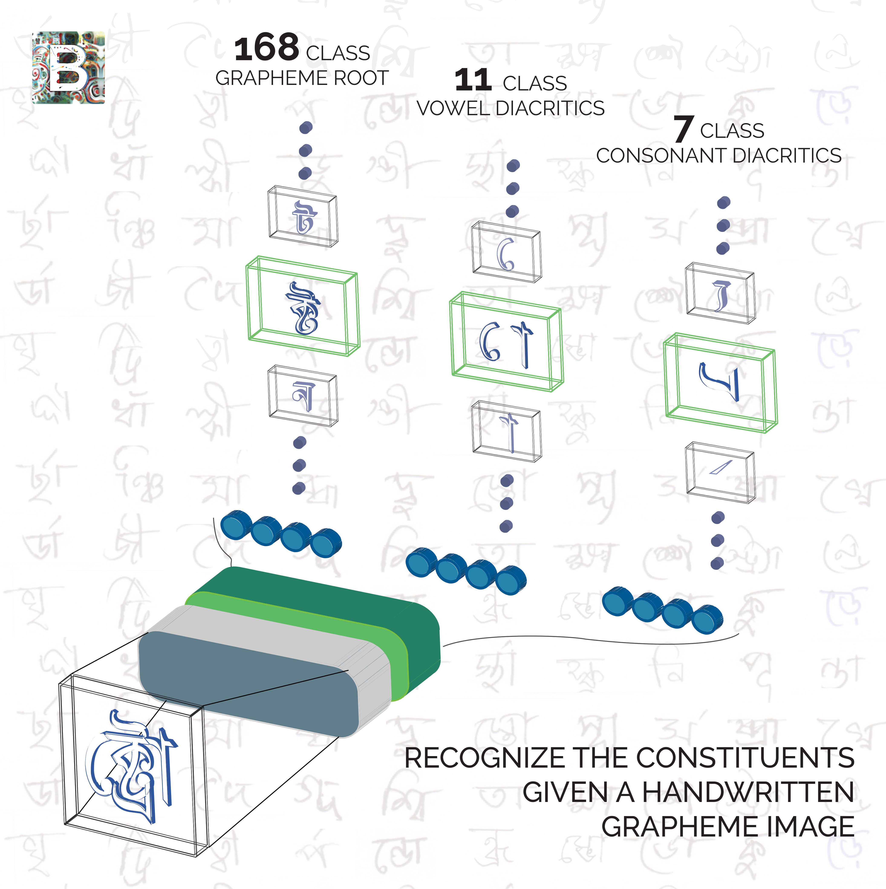

# Kaggle Competition - bengaliai-cv19

Bengali is the 5th most spoken language in the world with hundreds of million of speakers. It’s the official language of Bangladesh and the second most spoken language in India. Considering its reach, there’s significant business and educational interest in developing AI that can optically recognize images of the language handwritten.  

Optical character recognition is particularly challenging for Bengali. While Bengali has 49 letters (to be more specific 11 vowels and 38 consonants) in its alphabet, there are also 18 potential diacritics, or accents. This means that there are many more graphemes, or the smallest units in a written language. The added complexity results in ~13,000 different grapheme variations (compared to English’s 250 graphemic units).  

There are two kernels the first kernel is use to train and save the model trained. So, I also included trained model .h5 file.
And second kernel is to predict using the trained model.  
  
Please find the below link to get to know more about the compeptition on Kaggle:  
https://www.kaggle.com/c/bengaliai-cv19  

Thank You for watching this repository and Appreciate your view.
